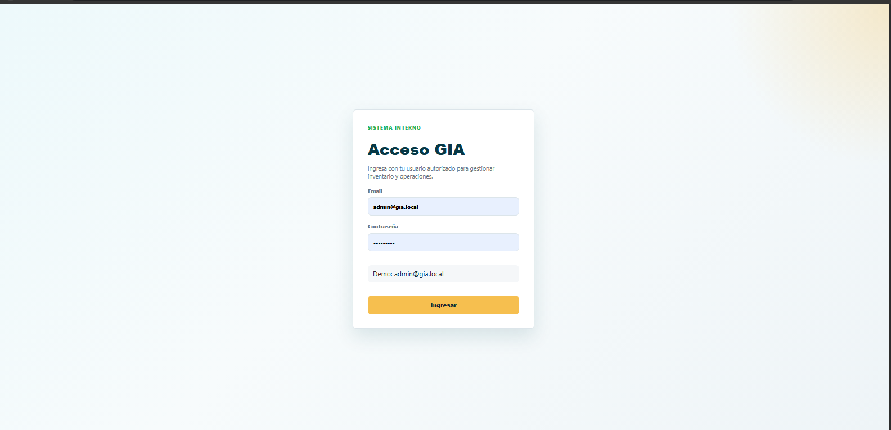
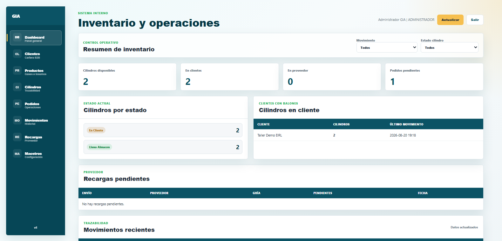
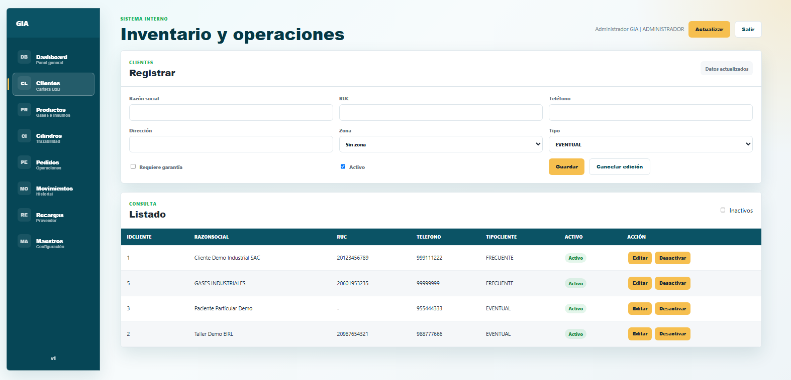
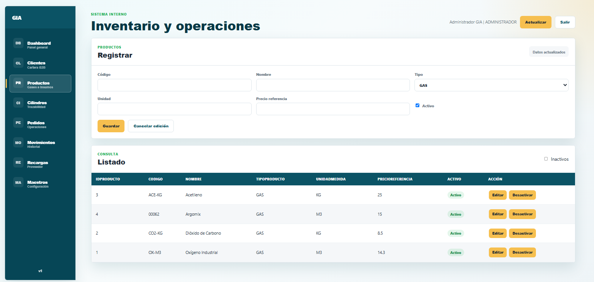
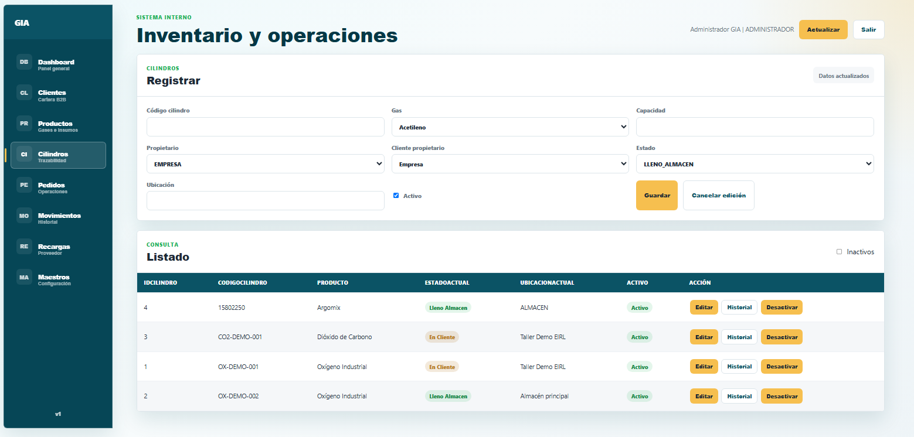
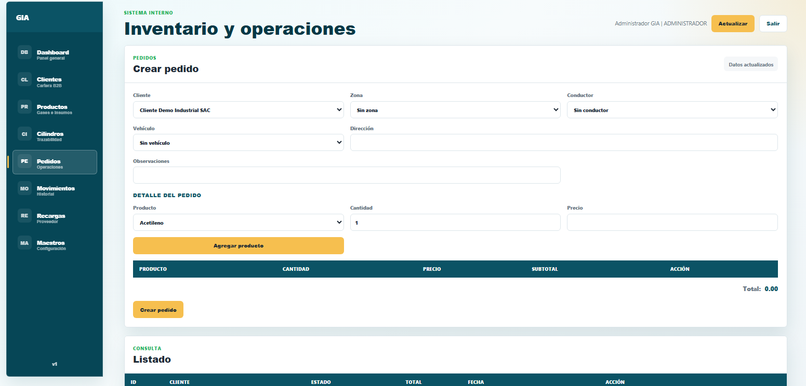
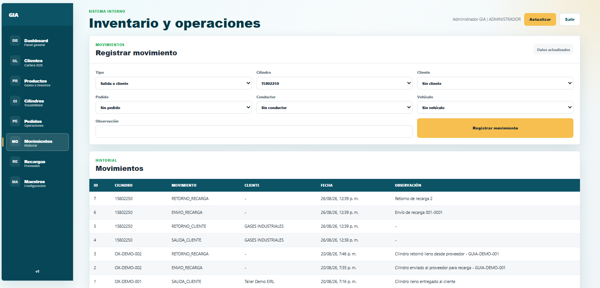
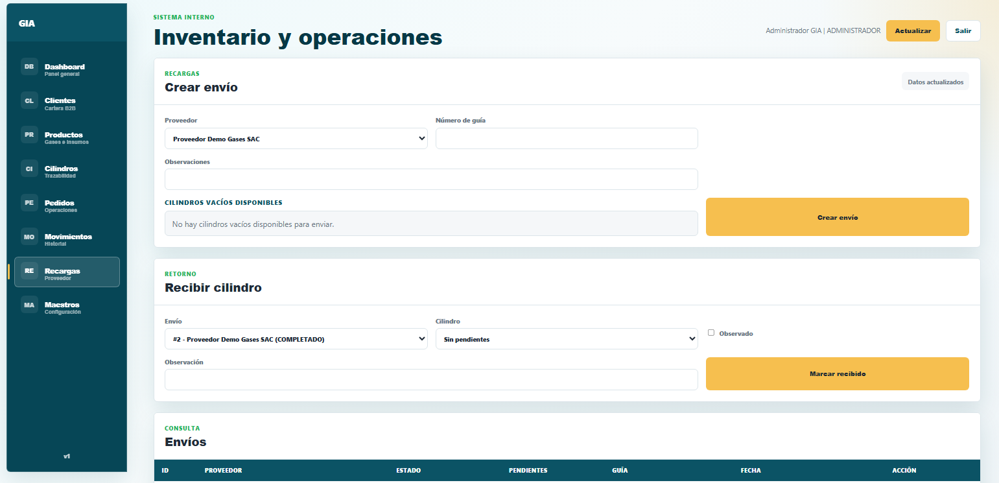
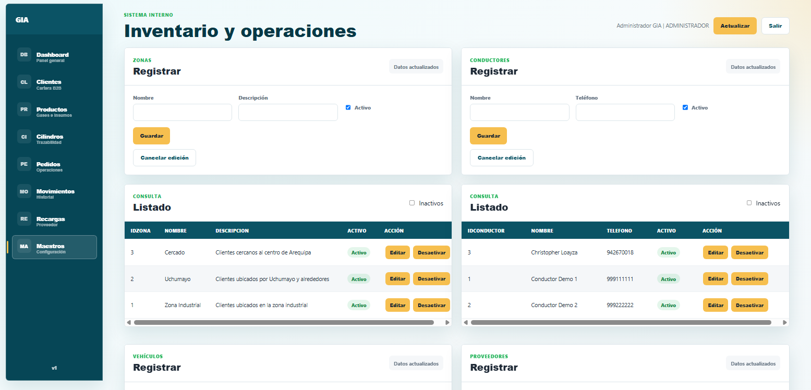

# Gases Industriales AQP - Dashboard de Inventario y Operaciones

Sistema interno para gestionar inventario, cilindros, pedidos, movimientos, recargas con proveedores y usuarios de una empresa de gases industriales.

Este proyecto forma parte de un portafolio técnico y está inspirado en una operación real de suministro de gases, recarga/canje de cilindros y venta de insumos industriales.

## Estado del Proyecto

Proyecto en desarrollo. Actualmente incluye:

- API REST con ASP.NET Core.
- Base de datos PostgreSQL.
- Frontend web integrado en `wwwroot`.
- CRUD de clientes, productos, cilindros, pedidos, movimientos, recargas y maestros.
- Autenticación con JWT.
- Hash de contraseñas con PBKDF2.
- Roles `ADMINISTRADOR` y `TRABAJADOR`.
- Dashboard con reportes operativos.
- Manejo global de errores.
- Configuración sensible fuera del repositorio mediante User Secrets.

## Capturas

Estas capturas muestran el estado actual del sistema interno: acceso, dashboard operativo y modulos principales de gestion.

### Login



### Dashboard



### Clientes



### Productos



### Cilindros



### Pedidos



### Movimientos



### Recargas



### Maestros



## Tecnologías

- C# / ASP.NET Core
- Entity Framework Core
- PostgreSQL
- JWT Bearer Authentication
- HTML
- CSS
- JavaScript
- Git / GitHub

## Arquitectura

```text
GasesIndustrialesDASHBOARD/
├── database/
│   ├── schema.sql
│   ├── seed.sql
│   ├── queries.sql
│   ├── fix_sequences.sql
│   └── migrations/
│       ├── 001_add_tipo_producto.sql
│       └── 002_add_usuarios.sql
└── GasesIndustriales/
    ├── GasesIndustriales.slnx
    └── GasesIndustriales.Api/
        ├── Controllers/
        ├── Data/
        ├── Dtos/
        ├── Middleware/
        ├── Models/
        ├── Services/
        ├── wwwroot/
        ├── Program.cs
        └── appsettings.json
```

### Capas Principales

`Controllers`: reciben peticiones HTTP y devuelven respuestas.

`Dtos`: definen los datos que entran y salen de la API.

`Models`: representan las tablas principales de la base de datos.

`Data`: contiene `AppDbContext`, encargado de mapear modelos con PostgreSQL.

`Services`: contiene lógica reutilizable, como autenticación, hash de contraseñas y manejo de hora UTC.

`Middleware`: contiene manejo global de errores.

`wwwroot`: contiene el frontend del sistema.

## Base de Datos

Motor utilizado: PostgreSQL.

Archivos principales:

- `database/schema.sql`: crea la estructura completa de tablas.
- `database/seed.sql`: inserta datos demo.
- `database/queries.sql`: consultas útiles de prueba.
- `database/fix_sequences.sql`: repara secuencias `SERIAL` si se insertaron datos manuales.
- `database/migrations/`: cambios incrementales sobre una base ya creada.

### Crear Base de Datos

Crear una base de datos en PostgreSQL, por ejemplo:

```sql
CREATE DATABASE gases_industriales;
```

Luego ejecutar:

```text
database/schema.sql
database/seed.sql
database/migrations/001_add_tipo_producto.sql
database/migrations/002_add_usuarios.sql
```

Si ya tienes la base creada y solo necesitas agregar usuarios, ejecuta:

```text
database/migrations/002_add_usuarios.sql
```

## Configuración Segura

El archivo `appsettings.json` no debe contener contraseñas, claves JWT ni credenciales de PostgreSQL.

La configuración sensible debe guardarse con User Secrets.

Desde la carpeta del proyecto API:

```bash
cd GasesIndustriales/GasesIndustriales.Api
```

Configurar conexión a PostgreSQL:

```bash
dotnet user-secrets set "ConnectionStrings:DefaultConnection" "Host=localhost;Port=5432;Database=gases_industriales;Username=TU_USUARIO;Password=TU_PASSWORD"
```

Configurar clave JWT:

```bash
dotnet user-secrets set "Jwt:Secret" "UNA_CLAVE_LARGA_Y_SEGURA_PARA_DESARROLLO"
```

El repositorio solo guarda configuración no sensible:

```json
{
  "Jwt": {
    "Issuer": "GasesIndustriales.Api",
    "Audience": "GasesIndustriales.Frontend",
    "ExpirationMinutes": 120
  }
}
```

## Cómo Ejecutar

Restaurar dependencias:

```bash
dotnet restore GasesIndustriales/GasesIndustriales.Api/GasesIndustriales.Api.csproj
```

Compilar:

```bash
dotnet build GasesIndustriales/GasesIndustriales.Api/GasesIndustriales.Api.csproj
```

Ejecutar:

```bash
dotnet run --project GasesIndustriales/GasesIndustriales.Api/GasesIndustriales.Api.csproj
```

Abrir en el navegador:

```text
https://localhost:7022
```

La URL exacta puede cambiar según `launchSettings.json` o Visual Studio.

## Usuario Demo

El `seed.sql` y la migración `002_add_usuarios.sql` crean un usuario demo para desarrollo:

```text
Email: admin@gia.local
Password: Admin123*
Rol: ADMINISTRADOR
```

Importante: este usuario es solo para entorno local/demo. En producción se debe cambiar o eliminar.

## Autenticación y Roles

El sistema usa JWT para proteger la API.

Flujo:

1. El usuario inicia sesión en `/api/auth/login`.
2. La API valida email y contraseña.
3. Si las credenciales son correctas, devuelve un token JWT.
4. El frontend guarda el token en `localStorage`.
5. Cada llamada protegida envía el token en el header:

```http
Authorization: Bearer TOKEN
```

Roles implementados:

- `ADMINISTRADOR`: puede administrar usuarios y operar el sistema.
- `TRABAJADOR`: puede operar el sistema, pero no administrar usuarios.

## Endpoints Principales

### Autenticación

| Método | Endpoint | Descripción |
|---|---|---|
| POST | `/api/auth/login` | Iniciar sesión |
| GET | `/api/auth/me` | Obtener usuario autenticado |

### Dashboard

| Método | Endpoint | Descripción |
|---|---|---|
| GET | `/api/dashboard/resumen` | Resumen operativo |
| GET | `/api/dashboard/resumen?tipoMovimiento=SALIDA_CLIENTE` | Filtrar movimientos recientes |
| GET | `/api/dashboard/resumen?estadoCilindro=EN_CLIENTE` | Filtrar por estado de cilindro |

### Clientes

| Método | Endpoint | Descripción |
|---|---|---|
| GET | `/api/clientes` | Listar clientes activos |
| GET | `/api/clientes?incluirInactivos=true` | Listar clientes activos e inactivos |
| GET | `/api/clientes?buscar=texto` | Buscar por razón social o RUC |
| GET | `/api/clientes/{id}` | Obtener cliente por ID |
| POST | `/api/clientes` | Crear cliente |
| PUT | `/api/clientes/{id}` | Editar cliente |
| DELETE | `/api/clientes/{id}` | Desactivar cliente |
| PATCH | `/api/clientes/{id}/reactivar` | Reactivar cliente |

### Productos

| Método | Endpoint | Descripción |
|---|---|---|
| GET | `/api/productos` | Listar productos activos |
| GET | `/api/productos?tipo=GAS` | Filtrar por tipo |
| GET | `/api/productos/{id}` | Obtener producto por ID |
| POST | `/api/productos` | Crear producto |
| PUT | `/api/productos/{id}` | Editar producto |
| DELETE | `/api/productos/{id}` | Desactivar producto |
| PATCH | `/api/productos/{id}/reactivar` | Reactivar producto |

### Cilindros

| Método | Endpoint | Descripción |
|---|---|---|
| GET | `/api/cilindros` | Listar cilindros activos |
| GET | `/api/cilindros?incluirInactivos=true` | Listar activos e inactivos |
| GET | `/api/cilindros/{id}` | Obtener cilindro por ID |
| GET | `/api/cilindros/{id}/movimientos` | Ver historial del cilindro |
| POST | `/api/cilindros` | Registrar cilindro |
| PUT | `/api/cilindros/{id}` | Editar cilindro |
| DELETE | `/api/cilindros/{id}` | Desactivar cilindro |
| PATCH | `/api/cilindros/{id}/reactivar` | Reactivar cilindro |

### Pedidos

| Método | Endpoint | Descripción |
|---|---|---|
| GET | `/api/pedidos` | Listar pedidos |
| GET | `/api/pedidos?estado=PENDIENTE` | Filtrar por estado |
| GET | `/api/pedidos/{id}` | Ver detalle de pedido |
| POST | `/api/pedidos` | Crear pedido con detalles |
| PUT | `/api/pedidos/{id}` | Editar pedido pendiente |
| PATCH | `/api/pedidos/{id}/asignacion` | Asignar conductor y vehículo |
| PATCH | `/api/pedidos/{id}/estado` | Cambiar estado |
| PATCH | `/api/pedidos/{id}/cancelar` | Cancelar pedido |

### Movimientos de Cilindros

| Método | Endpoint | Descripción |
|---|---|---|
| GET | `/api/movimientos` | Listar movimientos |
| POST | `/api/movimientos/salida-cliente` | Registrar salida hacia cliente |
| POST | `/api/movimientos/retorno-cliente` | Registrar retorno del cliente |
| POST | `/api/movimientos/envio-proveedor` | Enviar cilindro a proveedor |
| POST | `/api/movimientos/retorno-recarga` | Registrar retorno de recarga |

### Recargas

| Método | Endpoint | Descripción |
|---|---|---|
| GET | `/api/recargas/envios` | Listar envíos de recarga |
| GET | `/api/recargas/envios/{id}` | Ver detalle de envío |
| POST | `/api/recargas/envios` | Crear envío de recarga |
| PATCH | `/api/recargas/envios/{idEnvio}/cilindros/{idCilindro}/recibir` | Marcar cilindro recibido |
| PATCH | `/api/recargas/envios/{id}/cerrar` | Cerrar envío |

### Maestros

| Recurso | Endpoints |
|---|---|
| Zonas | `/api/zonas` |
| Conductores | `/api/conductores` |
| Vehículos | `/api/vehiculos` |
| Proveedores | `/api/proveedores` |
| Usuarios | `/api/usuarios` |

Los recursos maestros tienen operaciones CRUD básicas: listar, crear, editar, desactivar y reactivar.

`/api/usuarios` requiere rol `ADMINISTRADOR`.

## Reglas de Negocio Implementadas

- No se borran registros críticos físicamente; se desactivan con `activo = false`.
- No se permite duplicar RUC, placa o código de cilindro activo.
- Un cilindro solo puede asociarse a productos de tipo `GAS`.
- No se puede entregar un cilindro que no esté lleno en almacén.
- No se puede enviar a recarga un cilindro que no esté vacío en almacén.
- No se puede cerrar un envío de recarga con cilindros pendientes.
- Los pedidos calculan subtotales y total desde `detalle_pedido`.
- Las contraseñas se guardan hasheadas, no en texto plano.

## Reportes Actuales

El dashboard muestra:

- Cilindros disponibles.
- Cilindros en clientes.
- Cilindros en proveedor.
- Pedidos pendientes.
- Movimientos recientes.
- Estados visuales de cilindros.
- Clientes con cilindros asignados.
- Recargas pendientes.

## Seguridad

Este repositorio no debe contener:

- Contraseñas reales.
- Claves JWT reales.
- Connection strings con usuario y contraseña.
- API keys.
- Datos privados de clientes reales.

Antes de publicar cambios, revisar:

```bash
git status
git diff
```

## Próximos Pasos

- Agregar capturas finales del dashboard.
- Mejorar pruebas de endpoints.
- Agregar paginación y filtros avanzados.
- Agregar reportes descargables.
- Separar frontend en una aplicación moderna si el proyecto crece.
- Implementar auditoría de acciones por usuario.
